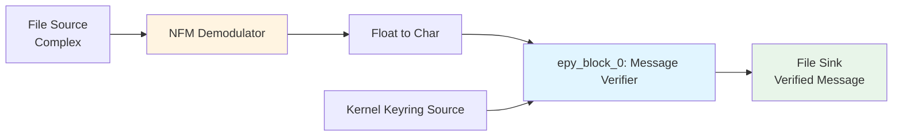

# GNU Radio Flowgraph Examples

This directory contains GNU Radio Companion (GRC) flowgraph examples for authenticated message transmission and reception using NFM modulation and AX.25 framing.

## Overview

These flowgraphs demonstrate the authenticated control system using:
- **NFM (Narrow Band FM)** modulation for radio transmission
- **AX.25** framing for packet radio protocol
- **PKCS#11** or **Kernel Keyring** for cryptographic key management
- **Two-frame protocol** for legal compliance (command data + signature in separate frames)

## File Structure

### Flowgraph Files (`.grc`)

- **`signed-message-tx.grc`**: Transmitter flowgraph combining audio and signed data
- **`signed-message-rx.grc`**: Receiver flowgraph for verifying signed messages
- **`confirmed-command.grc`**: Bidirectional command exchange flowgraph

### Generated Python Files

When you compile a `.grc` file using GNU Radio Companion or `grcc`, the following files are generated:

**For `signed-message-tx.grc`**:
- `signed_message_tx.py`: Main flowgraph execution code
- `signed_message_tx_epy_block_0.py`: Message signer embedded Python block
- `signed_message_tx_epy_block_1.py`: Audio/data scheduler embedded Python block

**For `signed-message-rx.grc`**:
- `signed_message_rx.py`: Main flowgraph execution code
- `signed_message_rx_epy_block_0.py`: Message verifier embedded Python block

**For `confirmed-command.grc`**:
- `confirmed_command.py`: Main flowgraph execution code
- Additional epy_block files as needed

### Embedded Python Blocks (`epy_block`)

Embedded Python blocks are custom signal processing blocks written in Python:

- **Purpose**: Allow custom signal processing logic within GNU Radio flowgraphs
- **Location**: Generated as separate `.py` files alongside the main flowgraph
- **Usage**: Automatically imported and used by the main flowgraph
- **Modification**: Edit the `.py` file directly, or modify the `_source_code` parameter in the `.grc` file

### Block Types Used

- **GUI Variables**: User interface controls (buttons, text fields, checkboxes)
- **Sources**: Audio input, file input, kernel keyring, SDR hardware
- **Sinks**: File output, audio output, SDR hardware, null sink (placeholder)
- **Processing**: Throttle, converters, modulators, demodulators, encoders, decoders
- **Custom Blocks**: Embedded Python blocks for signing, verification, scheduling

## Flowgraphs

### 1. Signed Message Transmitter (`signed-message-tx.grc`)

**Purpose**: Transmits signed text messages using NFM modulation and AX.25 encoding. This flowgraph combines live microphone audio with authenticated command data, transmitting both voice and signed commands over radio.

**Files Generated**:
- `signed_message_tx.py`: Main flowgraph Python code (generated by GRC)
- `signed_message_tx_epy_block_0.py`: Message signer embedded Python block
- `signed_message_tx_epy_block_1.py`: Audio/data scheduler embedded Python block

#### Flowgraph Diagram

```mermaid
graph LR
    A[Audio Source<br/>Mic Input] --> S[epy_block_1:<br/>Audio/Data Scheduler]
    B[GUI: Message Text] --> C[GUI: Send Button]
    D[GUI: Use PKCS#11] --> E[epy_block_0:<br/>Message Signer]
    F[Kernel Keyring Source] --> E
    E --> T[blocks_throttle2_0]
    T --> G[AX.25 Encoder]
    G --> H[Char to Float]
    H --> S
    S --> I[NFM Modulator]
    I --> J[blocks_null_sink<br/>(RF HW Placeholder)]
    
    style E fill:#e1f5ff
    style S fill:#f3e5f5
    style I fill:#fff4e1
    style G fill:#e8f5e9
```

#### Complete Block Reference

##### GUI Control Variables

- **`message_text`** (variable_qtgui_entry):
  - **Function**: Text input field for the message to be signed and transmitted
  - **Type**: String
  - **Default**: Empty string
  - **Usage**: Operator enters command text (e.g., "SET_SQUELCH -120")

- **`send_button`** (variable_qtgui_push_button):
  - **Function**: Button to trigger message signing and transmission
  - **Type**: Boolean (0/1)
  - **Behavior**: When pressed, triggers `epy_block_0` to sign the message and begin transmission
  - **Usage**: Click to send the current message text

- **`use_pkcs11`** (variable_qtgui_check_box):
  - **Function**: Toggle between PKCS#11 hardware tokens and Kernel Keyring
  - **Type**: Boolean
  - **Default**: True (PKCS#11 enabled)
  - **Usage**: Check for hardware tokens (Nitrokey/YubiKey), uncheck for software keys

- **`dest_callsign`** (variable_qtgui_entry):
  - **Function**: Destination callsign for AX.25 frame addressing
  - **Type**: String
  - **Default**: "N0CALL"
  - **Format**: 6 characters, SSID appended separately
  - **Usage**: Set to target repeater or station callsign

- **`src_callsign`** (variable_qtgui_entry):
  - **Function**: Source callsign identifying the transmitter
  - **Type**: String
  - **Default**: "N0CALL"
  - **Format**: 6 characters, SSID appended separately
  - **Usage**: Set to your licensed callsign

- **`nitrokey_slot`** (variable_qtgui_entry):
  - **Function**: Slot number for Nitrokey device (if using PKCS#11)
  - **Type**: Integer
  - **Default**: 1
  - **Usage**: Only relevant when PKCS#11 is enabled

- **`samp_rate`** (variable):
  - **Function**: Sample rate for the entire flowgraph
  - **Type**: Real (Hz)
  - **Default**: 48000
  - **Usage**: Must match audio hardware and RF sink sample rates

##### Cryptographic Blocks

- **`linux_crypto_kernel_keyring_source_0`** (linux_crypto_kernel_keyring_source):
  - **Function**: Provides cryptographic keys from Linux kernel keyring
  - **Input**: None (keyring access)
  - **Output**: Byte stream of key material (32 bytes for Ed25519)
  - **Parameters**:
    - `key_id`: Key identifier in kernel keyring (default: 0)
    - `auto_repeat`: Whether to continuously output key (default: False)
  - **Usage**: Fallback when PKCS#11 is disabled. Keys must be loaded into keyring via `keyctl` or similar tools.

- **`epy_block_0`** (Message Signer - PKCS#11/Kernel Keyring):
  - **File**: `signed_message_tx_epy_block_0.py`
  - **Function**: Signs messages using hardware tokens or software keys
  - **Input**: Byte stream from kernel keyring (when PKCS#11 disabled)
  - **Output**: Signed message bytes: `message_bytes + 0x00 + signature`
  - **Behavior**:
    1. Monitors `send_button` state
    2. When button pressed, reads `message_text` from GUI
    3. Signs message using PKCS#11 (if enabled) or Kernel Keyring + NaCl
    4. Outputs signed message as byte stream
  - **Signing Methods**:
    - **PKCS#11**: Uses `python3-pkcs11` to access hardware tokens (Nitrokey, YubiKey)
    - **Kernel Keyring**: Uses Ed25519 signing via `gnuradio.nacl` module
  - **Error Handling**: Falls back to software signing if hardware unavailable

##### Audio Input Block

- **`audio_source_0`** (audio_source):
  - **Function**: Captures live microphone audio input
  - **Input**: None (hardware audio device)
  - **Output**: Float32 audio samples
  - **Parameters**:
    - `samp_rate`: Sample rate (default: 48000 Hz)
    - `device_name`: ALSA/PulseAudio device name (default: "default")
  - **Usage**: Connects to system default audio input. For specific devices, use ALSA device names (e.g., "hw:0,0" for first soundcard).

##### Rate Control Block

- **`blocks_throttle2_0`** (blocks_throttle2):
  - **Function**: Limits data rate to prevent buffer overflows and ensure proper timing
  - **Input**: Byte stream from message signer
  - **Output**: Rate-limited byte stream
  - **Parameters**:
    - `samples_per_second`: Maximum output rate (default: samp_rate)
    - `ignoretag`: Whether to ignore stream tags (default: True)
    - `limit`: Rate limiting mode (default: "auto")
    - `maximum`: Maximum rate multiplier (default: 0.1)
  - **Usage**: Ensures AX.25 encoder receives data at correct symbol rate. Critical for proper packet timing.

##### Packet Encoding Blocks

- **`packet_protocols_ax25_encoder_0`** (packet_protocols_ax25_encoder):
  - **Function**: Encodes byte stream into AX.25 frame format
  - **Input**: Byte stream (rate-limited)
  - **Output**: AX.25 frame bytes (with flags, address, control, PID, info, FCS)
  - **Parameters**:
    - `src_callsign`: Source callsign (from GUI variable)
    - `src_ssid`: Source SSID (default: 0)
    - `dest_callsign`: Destination callsign (from GUI variable)
    - `dest_ssid`: Destination SSID (default: 0)
    - `digipeaters`: Digipeater path (default: empty)
    - `command_response`: Command/Response bit (default: False)
    - `poll_final`: Poll/Final bit (default: False)
  - **Usage**: Converts signed message bytes into valid AX.25 frame for radio transmission.

- **`blocks_char_to_float_0`** (blocks_char_to_float):
  - **Function**: Converts byte stream to float32 for modulation
  - **Input**: Byte stream (AX.25 encoded)
  - **Output**: Float32 samples
  - **Parameters**:
    - `scale`: Scaling factor (default: 1.0/127.0)
    - `vlen`: Vector length (default: 1)
  - **Usage**: Converts digital bytes to analog float samples for NFM modulation.

##### Audio/Data Scheduling Block

- **`epy_block_1`** (Audio/Data Scheduler):
  - **File**: `signed_message_tx_epy_block_1.py`
  - **Function**: Multiplexes microphone audio and AX.25 data packets
  - **Input**: 
    - Port 0: Float32 audio samples from microphone
    - Port 1: Float32 data samples from AX.25 encoder
  - **Output**: Float32 samples (audio or data)
  - **Behavior**:
    1. While audio is active (above threshold), passes audio through
    2. After silence detected (hold period), switches to data
    3. Passes data samples when available
    4. Returns to silence/zero when neither active
  - **Parameters**:
    - `silence_threshold`: Audio level threshold (default: 0.001)
    - `hold_samples`: Samples to hold after audio ends (default: 2400 = 50ms at 48kHz)
  - **Usage**: Ensures audio transmission happens first, then data packets follow after voice ends.

##### Modulation Block

- **`qradiolink_mod_nbfm_0`** (qradiolink_mod_nbfm):
  - **Function**: Modulates baseband signal using Narrow Band FM
  - **Input**: Float32 baseband samples
  - **Output**: Complex samples (I/Q) at RF frequency
  - **Parameters**:
    - `samp_rate`: Sample rate (default: 48000 Hz)
    - `carrier_freq`: Audio carrier frequency (default: 1700 Hz)
    - `filter_width`: Audio filter bandwidth (default: 8000 Hz)
    - `sps`: Samples per symbol (default: 125)
  - **Usage**: Converts baseband audio/data to FM-modulated signal ready for RF transmission.

##### RF Output Block (Placeholder)

- **`blocks_null_sink_0`** (blocks_null_sink):
  - **Function**: Discards samples (placeholder for real RF hardware)
  - **Input**: Complex samples from NFM modulator
  - **Output**: None (samples discarded)
  - **Type**: Complex (I/Q)
  - **Usage**: **REPLACE THIS BLOCK** with actual RF hardware sink (see Hardware Integration section below).

#### Configuration

- **Sample Rate**: 48000 Hz (default, matches common audio hardware)
- **NFM Parameters**:
  - Carrier Frequency: 1700 Hz
  - Filter Width: 8000 Hz
  - Samples per Symbol: 125

#### Usage

1. Open `signed-message-tx.grc` in GNU Radio Companion
2. Configure callsigns (source and destination)
3. Choose authentication method (PKCS#11 checkbox)
4. Enter message text
5. Click "Send" button
6. RF output routed to your SDR/audio hardware (replace `blocks_null_sink`)

#### Hardware Integration

##### Replacing the Null Sink with Real RF Hardware

The `blocks_null_sink_0` block is a placeholder that discards samples. For real radio transmission, replace it with one of the following:

**Option 1: SDR Hardware (osmosdr_sink)**
```
Block: osmosdr_sink
Parameters:
  - samp_rate: 48000 (must match flowgraph)
  - device_args: "hackrf=0" (or your SDR device)
  - frequency: 145000000 (your TX frequency in Hz)
  - gain: 0 (adjust as needed)
  - bandwidth: 0 (auto)
```

**Option 2: Audio Hardware (audio_sink)**
```
Block: audio_sink
Parameters:
  - samp_rate: 48000
  - device_name: "default" (or specific ALSA device)
```

**Option 3: File Output (for testing)**
```
Block: blocks_file_sink
Parameters:
  - file: "/tmp/tx_output.bin"
  - type: complex
```

**Important**: When replacing the null sink:
1. Ensure sample rate matches (48000 Hz)
2. Keep `blocks_throttle2_0` in the chain before AX.25 encoder
3. Verify your hardware supports complex I/Q samples (for SDR) or float samples (for audio)

##### Audio Hardware Configuration

**Using Specific Audio Devices**:

1. **List available audio devices**:
   ```bash
   arecord -l  # For ALSA devices
   pactl list sources short  # For PulseAudio
   ```

2. **Update `audio_source_0` device_name**:
   - ALSA: Use "hw:0,0" format (card,device)
   - PulseAudio: Use device name from `pactl`
   - Default: "default" uses system default

3. **For professional audio interfaces**:
   - Use ALSA device names for direct hardware access
   - Example: "hw:USB,0" for USB audio devices

##### PTT (Push-To-Talk) Integration

PTT control is **not** built into this flowgraph. To add PTT functionality:

**Option 1: GPIO-based PTT (Raspberry Pi, BeagleBone)**

Add a GPIO control block before the RF sink:
```
Block: epy_block (PTT Controller)
Function: Controls GPIO pin based on audio/data activity
Code: Use RPi.GPIO or similar library to set PTT pin high during transmission
```

**Option 2: Serial PTT (for radio controllers)**

Add a serial port control block:
```
Block: blocks_serial_port_sink (or epy_block with pyserial)
Function: Sends PTT commands via serial port
Example: Send "PTT_ON" when transmission starts, "PTT_OFF" when done
```

**Option 3: External PTT via Message Port**

1. Add a message port to `epy_block_1` (scheduler):
   ```python
   self.message_port_register_out(pmt.intern("ptt_control"))
   ```

2. Send PTT messages when audio/data starts:
   ```python
   self.message_port_pub(pmt.intern("ptt_control"), pmt.PMT_T)  # PTT ON
   self.message_port_pub(pmt.intern("ptt_control"), pmt.PMT_F)  # PTT OFF
   ```

3. Connect to external PTT handler block

**Option 4: Hardware PTT via osmosdr**

Some SDR devices support hardware PTT:
```
osmosdr_sink parameters:
  - antenna: "TX/RX" (if supported)
  - Use device-specific PTT control
```

**PTT Timing Considerations**:
- **TX Delay**: Add delay before starting transmission (typically 50-200ms)
- **Hang Time**: Keep PTT active after transmission ends (typically 100-500ms)
- **VOX Alternative**: Use Voice Operated Exchange (VOX) instead of manual PTT

**Example PTT Integration Code** (for epy_block):

```python
import RPi.GPIO as GPIO

class ptt_control(gr.sync_block):
    def __init__(self, ptt_pin=18):
        # Initialize GPIO
        GPIO.setmode(GPIO.BCM)
        GPIO.setup(ptt_pin, GPIO.OUT)
        self.ptt_pin = ptt_pin
        self.ptt_active = False
        
    def work(self, input_items, output_items):
        # Monitor input for activity
        # Set PTT pin high when transmitting
        # Set PTT pin low when idle
        pass
```

### 2. Signed Message Receiver (`signed-message-rx.grc`)

**Purpose**: Receives and verifies signed messages using NFM demodulation and AX.25 decoding. This flowgraph demonstrates the receive side of the authenticated control system.

**Files Generated**:
- `signed_message_rx.py`: Main flowgraph Python code (generated by GRC)
- `signed_message_rx_epy_block_0.py`: Message verifier embedded Python block

#### Flowgraph Diagram



#### Complete Block Reference

##### Input Block

- **`blocks_file_source_0`** (blocks_file_source):
  - **Function**: Reads NFM-modulated signal from file (for testing/demo)
  - **Input**: File system
  - **Output**: Complex samples (I/Q)
  - **Parameters**:
    - `file`: File path (default: "/tmp/signed_message_tx.bin")
    - `type`: Data type (default: complex)
    - `repeat`: Whether to loop file (default: False)
  - **Usage**: **REPLACE THIS BLOCK** with real RF hardware source (see Hardware Integration section below).

##### Demodulation Block

- **`qradiolink_demod_nbfm_0`** (qradiolink_demod_nbfm):
  - **Function**: Demodulates Narrow Band FM signal
  - **Input**: Complex samples (I/Q) from RF source
  - **Output**: 
    - Port 0: Demodulated audio (float32)
    - Port 1: (if available) additional output
  - **Parameters**:
    - `samp_rate`: Sample rate (default: 250000 Hz)
    - `carrier_freq`: Audio carrier frequency (default: 1700 Hz)
    - `filter_width`: Audio filter bandwidth (default: 8000 Hz)
    - `sps`: Samples per symbol (default: 125)
  - **Usage**: Converts RF signal back to baseband audio/data.

##### Conversion Block

- **`blocks_float_to_char_0`** (blocks_float_to_char):
  - **Function**: Converts float32 audio samples to byte stream
  - **Input**: Float32 samples from demodulator
  - **Output**: Byte stream
  - **Parameters**:
    - `scale`: Scaling factor (default: 127.0)
    - `vlen`: Vector length (default: 1)
  - **Usage**: Converts analog demodulated signal back to digital bytes for processing.

##### Verification Block

- **`epy_block_0`** (Message Verifier):
  - **File**: `signed_message_rx_epy_block_0.py`
  - **Function**: Verifies message signatures and extracts verified content
  - **Input**: 
    - Port 0: Byte stream (message + signature)
    - Port 1: Public key bytes from kernel keyring
  - **Output**: Verified message bytes (signature removed)
  - **Behavior**:
    1. Receives message bytes with embedded signature (format: `message + 0x00 + signature`)
    2. Extracts message and signature portions
    3. Verifies signature using public key from kernel keyring
    4. Outputs verified message only if signature is valid
  - **Verification Method**: Uses Ed25519 signature verification via `gnuradio.nacl` module
  - **Error Handling**: Discards invalid messages silently

##### Key Source Block

- **`linux_crypto_kernel_keyring_source_0`** (linux_crypto_kernel_keyring_source):
  - **Function**: Provides public key for signature verification
  - **Input**: None (keyring access)
  - **Output**: Byte stream of public key material (32 bytes for Ed25519)
  - **Parameters**:
    - `key_id`: Key identifier in kernel keyring (default: 0)
    - `auto_repeat`: Whether to continuously output key (default: False)
  - **Usage**: Keys must be loaded into keyring via `keyctl` or similar tools.

##### Output Block

- **`blocks_file_sink_0`** (blocks_file_sink):
  - **Function**: Saves verified message to file (for testing/demo)
  - **Input**: Byte stream (verified message)
  - **Output**: File system
  - **Parameters**:
    - `file`: Output file path (default: "/tmp/verified_message.bin")
    - `type`: Data type (default: byte)
    - `append`: Whether to append to file (default: False)
  - **Usage**: **REPLACE THIS BLOCK** with command processor or message handler for real operation.

#### Configuration

- **Input File**: `/tmp/signed_message_tx.bin` (complex samples) - for testing
- **Output File**: `/tmp/verified_message.bin` (verified message bytes) - for testing
- **NFM Parameters**: Same as transmitter
  - Carrier Frequency: 1700 Hz
  - Filter Width: 8000 Hz
  - Samples per Symbol: 125

#### Usage

1. Open `signed-message-rx.grc` in GNU Radio Companion
2. Ensure input file exists (from transmitter) or configure RF hardware source
3. Configure kernel keyring key ID
4. Run flowgraph
5. Verified message saved to output file or processed by command handler

#### Hardware Integration

##### Replacing File Source with Real RF Hardware

The `blocks_file_source_0` block reads from a file for testing. For real radio reception, replace it with:

**Option 1: SDR Hardware (osmosdr_source)**
```
Block: osmosdr_source
Parameters:
  - samp_rate: 250000 (or your SDR's sample rate)
  - device_args: "hackrf=0" (or your SDR device)
  - frequency: 145000000 (your RX frequency in Hz)
  - gain: 0 (adjust as needed)
  - bandwidth: 0 (auto)
```

**Option 2: Audio Hardware (audio_source)**
```
Block: audio_source
Parameters:
  - samp_rate: 48000 (must match TX sample rate)
  - device_name: "default" (or specific ALSA device)
```

**Important**: When replacing the file source:
1. Ensure sample rate matches your SDR/audio hardware capabilities
2. Verify the demodulator parameters match the transmitter
3. For SDR, use complex I/Q samples; for audio, may need format conversion

##### Replacing File Sink with Command Processor

The `blocks_file_sink_0` block writes to a file for testing. For real operation, replace it with:

**Option 1: Command Processor Block**
```
Block: epy_block (Command Processor)
Function: Processes verified commands and executes actions
Code: Parse command, execute via subprocess or API, log results
```

**Option 2: Message Port Output**
```
Block: Use message ports to send verified commands to external handler
Function: Integrates with SVXLink or other repeater control systems
```

**Option 3: Network Socket**
```
Block: epy_block with socket output
Function: Sends verified commands over network to remote handler
```

### 3. Confirmed Command (`confirmed-command.grc`)

Combined transmitter/receiver for bidirectional authenticated command exchange.

#### Flowgraph Diagram



```mermaid
graph TB
    subgraph TX["Transmit Path"]
        A1[GUI: Command Text] --> B1[Message Signer]
        C1[PKCS#11/Kernel Keyring] --> B1
        B1 --> D1[AX.25 Encoder]
        D1 --> E1[NFM Modulator]
        E1 --> F1[Radio TX]
    end
    
    subgraph RX["Receive Path"]
        G1[Radio RX] --> H1[NFM Demodulator]
        H1 --> I1[AX.25 Decoder]
        I1 --> J1[Message Verifier]
        K1[Kernel Keyring] --> J1
        J1 --> L1[Command Processor]
        L1 --> M1[Response Signer]
        M1 --> N1[AX.25 Encoder]
        N1 --> O1[NFM Modulator]
        O1 --> P1[Radio TX]
    end
    
    style B1 fill:#e1f5ff
    style J1 fill:#e1f5ff
    style M1 fill:#e1f5ff
    style E1 fill:#fff4e1
    style H1 fill:#fff4e1
    style O1 fill:#fff4e1
```

> **Hardware TX note**: For real radios, connect the TX path (`NFM Modulator` output) through a `blocks_throttle` into the appropriate microphone/audio-input hardware instead of a file-based sink. This ensures the SDR/audio chain is paced correctly before feeding the repeater controller or handheld.

#### Block Description

This flowgraph combines both transmit and receive functionality:

- **Transmit Side**: Same as `signed-message-tx.grc`
- **Receive Side**: Same as `signed-message-rx.grc`
- **Command Processing**: Verifies incoming commands and generates signed responses

#### Usage

1. Open `confirmed-command.grc` in GNU Radio Companion
2. Configure both TX and RX paths
3. Set up command processor
4. Run flowgraph for bidirectional communication

## Authentication Methods

### PKCS#11 (Hardware Tokens)

Uses `python3-pkcs11` to access hardware security modules:
- **Nitrokey**: USB hardware security module
- **YubiKey**: Hardware security key
- **Other PKCS#11 tokens**: Any device supporting PKCS#11 standard

**Configuration**:
- Check "Use PKCS#11" checkbox in GUI
- PKCS#11 library auto-detected (OpenSC, p11-kit)
- PIN entry handled by PKCS#11 library

**Advantages**:
- Hardware-protected private keys
- Tamper-resistant key storage
- Industry-standard interface

### Kernel Keyring (Software Keys)

Uses `gr-linux-crypto` kernel keyring integration:
- Keys stored in Linux kernel keyring
- Accessible via `linux_crypto_kernel_keyring_source` block
- Software-based signing/verification

**Configuration**:
- Uncheck "Use PKCS#11" checkbox
- Keys loaded into kernel keyring via `keyctl` or similar
- Automatic key retrieval by flowgraph

**Advantages**:
- No hardware required
- Easy to test and develop
- Integrated with Linux security model

## Two-Frame Protocol

For legal compliance with amateur radio regulations, messages are transmitted in two separate AX.25 frames:

### Frame 1: Command/Result Data
- **PID**: `0xF0` (Command/Result data)
- **Content**: Unencrypted, readable text
- **Example**: `"SET_SQUELCH -120"`

### Frame 2: Signature
- **PID**: `0xF1` (Signature)
- **Content**: ECDSA signature proving authenticity
- **Format**: 64 bytes (Brainpool P256r1)

### Transmission Sequence

1. Transmit Frame 1 (command data)
2. Wait 100-500ms
3. Transmit Frame 2 (signature)

### Reception Sequence

1. Receive Frame 1, store in pending buffer
2. Wait up to 10 seconds for Frame 2
3. Match frames by timestamp
4. Verify signature
5. Process command if valid

## Dependencies

### GNU Radio Modules

- **gr-qradiolink**: NFM modulation/demodulation
- **gr-packet-protocols**: AX.25 encoding/decoding
- **gr-linux-crypto**: Kernel keyring integration (optional)

### Python Packages

- **python3-pkcs11**: PKCS#11 interface (for hardware tokens)
- **gnuradio**: GNU Radio runtime
- **numpy**: Numerical operations

### System Packages

- **opensc**: OpenSC PKCS#11 library (optional, for hardware tokens)
- **p11-kit**: PKCS#11 toolkit (optional)

## Building and Running

### Generate Python from GRC

```bash
cd examples/grc
grcc -o . signed-message-tx.grc
grcc -o . signed-message-rx.grc
grcc -o . confirmed-command.grc
```

### Run Generated Flowgraph

```bash
python3 signed_message_tx.py
python3 signed_message_rx.py
python3 confirmed_command.py
```

### Using GNU Radio Companion

1. Open `.grc` file in GNU Radio Companion
2. Configure parameters
3. Generate flowgraph (F6)
4. Execute (F7)

## Troubleshooting

### PKCS#11 Not Working

- Check that `python3-pkcs11` is installed: `python3 -c "from pkcs11 import lib"`
- Verify PKCS#11 library exists: `ls /usr/lib/*/opensc-pkcs11.so`
- Check token is connected: `pkcs11-tool --list-slots`

### Kernel Keyring Not Working

- Verify `gr-linux-crypto` is installed
- Check key is in keyring: `keyctl show`
- Ensure correct key ID is configured

### NFM Modulation Issues

- Verify `gr-qradiolink` is installed
- Check sample rate matches between TX and RX
- Ensure carrier frequency is correct

### AX.25 Encoding Issues

- Verify `gr-packet-protocols` is installed
- Check callsigns are valid (6 characters, SSID 0-15)
- Ensure frame format matches protocol specification

## See Also

- [Protocol Specification](../guides/PROTOCOL.md)
- [Operator Guide](../guides/OPERATOR_GUIDE.md)
- [Admin Guide](../guides/ADMIN_GUIDE.md)

