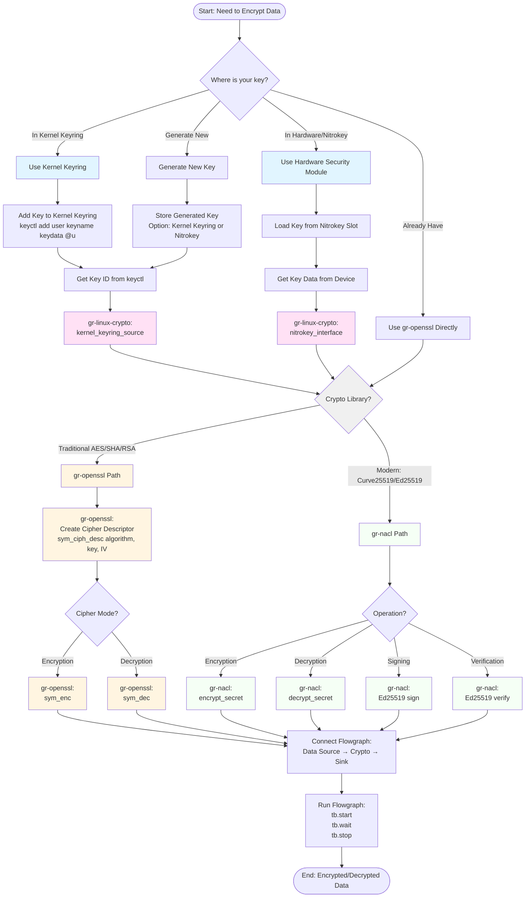

# gr-linux-crypto Usage Flowchart

## Overview

This document provides a visual guide for using gr-linux-crypto with gr-openssl and gr-nacl. It shows the complete workflow from key storage to encryption/decryption operations.

**Key Concept:** gr-linux-crypto provides Linux-specific key storage (kernel keyring, HSM), while gr-openssl and gr-nacl perform the actual cryptographic operations. They work together - gr-linux-crypto doesn't duplicate their functionality.

## Quick Summary

### With gr-openssl (Traditional Crypto)
1. **Store key** in kernel keyring or hardware (gr-linux-crypto provides this)
2. **Load key** using gr-linux-crypto blocks (kernel_keyring_source, nitrokey_interface)
3. **Create cipher** descriptor using gr-openssl (sym_ciph_desc)
4. **Encrypt/Decrypt** using gr-openssl (sym_enc/sym_dec)
5. **Connect flowgraph** and run

### With gr-nacl (Modern Crypto)
1. **Store key** in Nitrokey HSM (gr-linux-crypto provides this)
2. **Load key** using gr-linux-crypto blocks (nitrokey_interface)
3. **Encrypt/Decrypt** using gr-nacl (encrypt_secret/decrypt_secret, Curve25519, Ed25519)
4. **Connect flowgraph** and run

## Integration with gr-openssl and gr-nacl

This flowchart shows how to use gr-linux-crypto with gr-openssl and gr-nacl for secure key management and encryption.

### Visual Flowchart (Mermaid)



## Decision Points

### 1. Key Source Selection
- **Kernel Keyring**: Best for keys that need kernel-level protection
- **Hardware/Nitrokey**: Best for keys requiring physical security
- **Generate New**: Create key, then optionally store in keyring/HSM
- **Direct gr-openssl**: If key is already in memory (bypasses Linux-specific features)

### 2. gr-linux-crypto Role
- **Purpose**: Provides Linux-specific key sources (kernel keyring, HSM)
- **Does NOT**: Perform encryption/decryption (that's gr-openssl/gr-nacl's job)
- **Integration**: Acts as a bridge between Linux key storage and crypto modules

### 3. gr-openssl Role
- **Purpose**: Performs traditional cryptographic operations
- **Operations**: AES, SHA, RSA, HMAC, etc.
- **Input**: Key data (from gr-linux-crypto or directly)
- **Use when**: Need standard algorithms (AES, SHA, RSA)

### 4. gr-nacl Role
- **Purpose**: Performs modern cryptographic operations
- **Operations**: Curve25519, Ed25519, ChaCha20-Poly1305
- **Input**: Key data (from gr-linux-crypto Nitrokey or directly)
- **Use when**: Need modern crypto (Curve25519, Ed25519)

### Text-Based Flowchart (Plain Text)

```
┌─────────────────────────────────────────────────────────────────┐
│                    START: Need to Encrypt Data                  │
└───────────────────────┬─────────────────────────────────────────┘
                        │
                        ▼
            ┌───────────────────────┐
            │ Where is your key?    │
            └───────┬───────────────┘
                    │
        ┌───────────┼───────────┬──────────────┐
        │           │           │              │
        ▼           ▼           ▼              ▼
  [Kernel     [Hardware/    [Generate      [Already
   Keyring]    Nitrokey]     New Key]       Have Key]
        │           │           │              │
        │           │           │              │
        ▼           ▼           ▼              │
   Add Key    Load Key    Store Key           │
   to Ring    from Slot   (Optional)          │
        │           │           │              │
        │           │           │              │
        └───────────┴───────────┴──────────────┘
                        │
                        ▼
        ┌───────────────────────────────────┐
        │ gr-linux-crypto:                  │
        │ kernel_keyring_source OR          │
        │ nitrokey_interface                │
        └──────────────┬────────────────────┘
                       │
                       ▼
              ┌────────────────┐
              │ Choose Crypto: │
              │ gr-openssl OR  │
              │ gr-nacl        │
              └───────┬────────┘
                      │
          ┌───────────┴───────────┐
          │                       │
          ▼                       ▼
    ┌───────────┐          ┌───────────┐
    │ gr-openssl│          │ gr-nacl   │
    │ Path      │          │ Path      │
    └─────┬─────┘          └─────┬─────┘
          │                       │
          ▼                       ▼
    ┌───────────┐          ┌───────────┐
    │ sym_ciph_ │          │ encrypt_  │
    │ desc then │          │ secret OR │
    │ sym_enc/  │          │ Ed25519   │
    │ sym_dec   │          │ sign      │
    └─────┬─────┘          └─────┬─────┘
          │                       │
          └───────────┬───────────┘
                      │
                      ▼
        ┌───────────────────────────────────┐
        │ Connect Flowgraph:                │
        │ Data Source → Encryptor → Sink    │
        └──────────────┬────────────────────┘
                       │
                       ▼
        ┌───────────────────────────────────┐
        │ Run Flowgraph:                     │
        │ tb.start() → tb.wait() → tb.stop()│
        └──────────────┬────────────────────┘
                       │
                       ▼
              ┌─────────────────┐
              │ END: Encrypted/ │
              │ Decrypted Data  │
              └─────────────────┘
```

**Key Components:**
- **Blue boxes**: Key storage options (gr-linux-crypto provides)
- **Pink boxes**: gr-linux-crypto blocks (key sources)
- **Yellow boxes**: gr-openssl operations (traditional crypto)
- **Green boxes**: gr-nacl operations (modern crypto)

## Code Example Flow

```python
# Step 1: Store key in kernel keyring (using keyctl or Python helper)
from gr_linux_crypto.keyring_helper import KernelKeyringManager
keyring = KernelKeyringManager()
key_id = keyring.add_key("my_aes_key", b"32-byte-key-data-here")

# Step 2: Create kernel keyring source (gr-linux-crypto)
from gnuradio import linux_crypto
key_source = linux_crypto.kernel_keyring_source(key_id=key_id)

# Step 3a: For gr-openssl - Create cipher descriptor
from gnuradio import crypto
cipher_desc = crypto.sym_ciph_desc("aes-256-cbc", key_data, iv)
encryptor = crypto.sym_enc(cipher_desc)

# Step 3b: For gr-nacl - Use Nitrokey key with modern crypto
from gnuradio import nacl
encryptor = nacl.encrypt_secret("nitrokey_key")  # Uses Curve25519

# Step 5: Connect flowgraph
from gnuradio import gr, blocks
tb = gr.top_block()
data_source = blocks.file_source(...)
output_sink = blocks.file_sink(...)

tb.connect(data_source, encryptor)
tb.connect(encryptor, output_sink)

# Step 6: Run
tb.start()
tb.wait()
tb.stop()
```

## Alternative Paths

### Direct gr-openssl Usage (No Linux Features)
```
Key in Memory → gr-openssl (sym_enc/sym_dec) → Encrypted Data
```
- Use when: Key is already available in Python
- Skip: Kernel keyring, HSM integration
- Still uses: gr-openssl for encryption

### gr-linux-crypto Standalone (No gr-openssl/gr-nacl)
```
Kernel Keyring → gr-linux-crypto (kernel_crypto_aes) → Encrypted Data
```
- Use when: Want kernel crypto API directly
- Skip: gr-openssl, gr-nacl
- Uses: AF_ALG sockets (kernel crypto API)

### gr-linux-crypto with gr-nacl (Modern Crypto)
```
Nitrokey → gr-linux-crypto (nitrokey_interface) → gr-nacl (Curve25519/Ed25519) → Encrypted Data
```
- Use when: Need modern crypto with hardware key storage
- Uses: Nitrokey for key storage, gr-nacl for Curve25519/Ed25519 operations

## When to Use Each Approach

| Scenario | Use gr-linux-crypto + gr-openssl | Use gr-linux-crypto + gr-nacl | Use gr-openssl only | Use gr-nacl only | Use gr-linux-crypto only |
|----------|--------------------------------|------------------------------|---------------------|------------------|--------------------------|
| Need kernel-protected keys | Yes | Yes | No | No | No |
| Need HSM integration (Nitrokey) | Yes | Yes (Nitrokey) | No | No | No |
| Simple encryption, key in Python | No | No | Yes | Yes | No |
| Want kernel crypto API performance | No | No | No | No | Yes |
| Need Brainpool ECC | Yes (gr-linux-crypto) | No | No | No | No |
| Standard AES/SHA/RSA | Yes (via gr-openssl) | No | Yes | No | No |
| Need Curve25519/Ed25519 | No | Yes (via gr-nacl) | No | Yes | No |
| Modern crypto with HSM keys | No | Yes | No | No | No |

## Key Integration Points

1. **Key Storage**: gr-linux-crypto provides secure key storage (kernel keyring, HSM/Nitrokey)
2. **Key Retrieval**: gr-linux-crypto blocks provide keys to flowgraph
3. **Traditional Crypto**: gr-openssl performs AES/SHA/RSA operations
4. **Modern Crypto**: gr-nacl performs Curve25519/Ed25519 operations
5. **Result**: Secure key management + proven crypto operations (traditional or modern)

## Integration Examples

### Example 1: Kernel Keyring → gr-openssl (AES)
```python
# Store key in kernel keyring
key_id = keyring.add_key("aes_key", key_data)

# Use with gr-openssl
key_source = linux_crypto.kernel_keyring_source(key_id)
cipher = crypto.sym_ciph_desc("aes-256-cbc", key_data, iv)
encryptor = crypto.sym_enc(cipher)
```

### Example 2: Nitrokey → gr-nacl (Curve25519)
```python
# Load key from Nitrokey slot
nitrokey_source = linux_crypto.nitrokey_interface(slot=1)

# Use with gr-nacl
encryptor = nacl.encrypt_secret("nitrokey_key")  # Curve25519
```

### Example 3: Direct gr-nacl (No Hardware)
```python
# Use gr-nacl directly if key is in memory
encryptor = nacl.encrypt_secret(key_data)  # Curve25519
```

